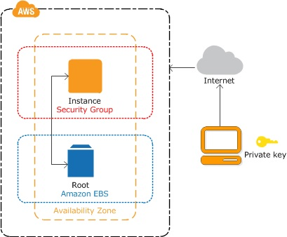

# Guide to creating an EC2 instance

In this tutorial, we will launch an Amazon Elastic Compute Cloud (EC2) instance. An EC2 instance is a Virtual Machine (VM) with user-defined configuration that runs on the cloud.

<!--more-->

[//]: # (Image References)

[image1]: ./images/Diagrama_AWS.jpeg "AWS Diagram"
[image2]: ./images/Bucket1.jpg "Development Bucket"
[image3]: ./images/Bucket2.jpg "Development Bucket"
[image4]: ./images/Bucket3.jpg "Development Bucket"
[image5]: ./images/Bucket4.jpg "Development Bucket"
[image6]: ./images/Bucket5.jpg "Development Bucket"
[image7]: ./images/Bucket6.jpg "Development Bucket"
[image8]: ./images/Bucket7.jpg "Development Bucket"
[image9]: ./images/Bucket8.jpg "Development Bucket"
[image10]: ./images/KeyPairs.jpg "Key Pairs"
[image11]: ./images/01Subida.jpg "Deployment"
[image12]: ./images/02Subida.jpg "Deployment"
[image13]: ./images/03Subida.jpg "Deployment"
[image14]: ./images/04Subida.jpg "Deployment"
[image15]: ./images/05Subida.jpg "Deployment"
[image16]: ./images/06Subida.jpg "Deployment"
[image17]: ./images/07Subida.jpg "Deployment"
[image18]: ./images/08Subida.jpg "Deployment"
[image19]: ./images/09Subida.jpg "Deployment"
[image20]: ./images/10Subida.jpg "Deployment"
[image21]: ./images/11Subida.jpg "Deployment"
[image22]: ./images/12Subida.jpg "Deployment"
[image23]: ./images/13Subida.jpg "Deployment"
[image24]: ./images/14Subida.jpg "Deployment"
[image25]: ./images/15Subida.jpg "Deployment"
[image26]: ./images/16Subida.jpg "Deployment"
[image27]: ./images/17Subida.jpg "Deployment"
[image28]: ./images/18Subida.jpg "Deployment"
[image29]: ./images/19Subida.jpg "Deployment"
[image30]: ./images/20Subida.jpg "Deployment"
[image31]: ./images/21Subida.jpg "Deployment"
[image32]: ./images/website.jpg "Website"

---

    

