# Guide to creating an EC2 instance
---
In this tutorial, we will launch an Amazon Elastic Compute Cloud (EC2) instance. An EC2 instance is a Virtual Machine (VM) with user-defined configuration that runs on the cloud.

    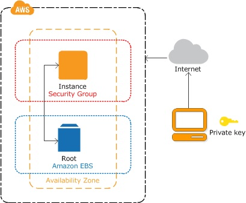

### Prerequisite

1. Create an AWS account.
2. Create an IAM administrator user and a normal IAM user.
3. Create a role with administrator permissions.
4. Create a key pairs.
5. Create the default VPC.

### Go to the EC2 Dashboard

1. Log in to your AWS account, and go to the AWS Management Console. Select the EC2 service.

    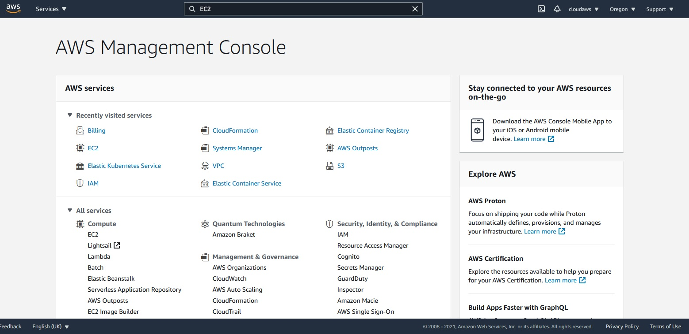
	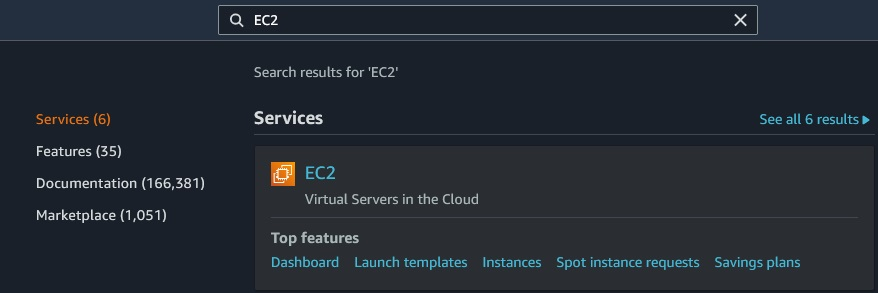

2. Have a look at the EC2 Dashboard. The EC2 Dashboard is home to a variety of related services, such as Amazon Machine Images, Elastic Block Store (EBS), Load Balancer, and Auto Scaling. 

    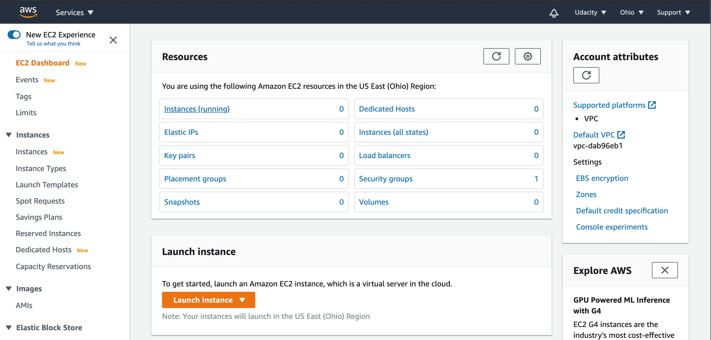

### Start the Launch Instance Wizard

Launching an instance is an eight-step process, as described below. At any stage, you can refer to the instruction given in the official documentation for help.

    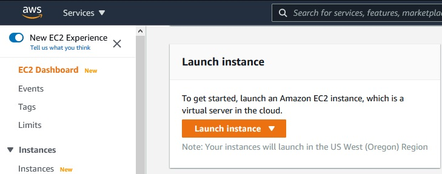

#### Step 1 - Choose an Amazon Machine Image (AMI)

An AMI is a template used to create a VM. AMI contains the pre-installed operating system, application server, and applications required to launch your instance. There is a variety of Linux, Windows, and other OS servers available. Choose the one available under the free-tier option.

    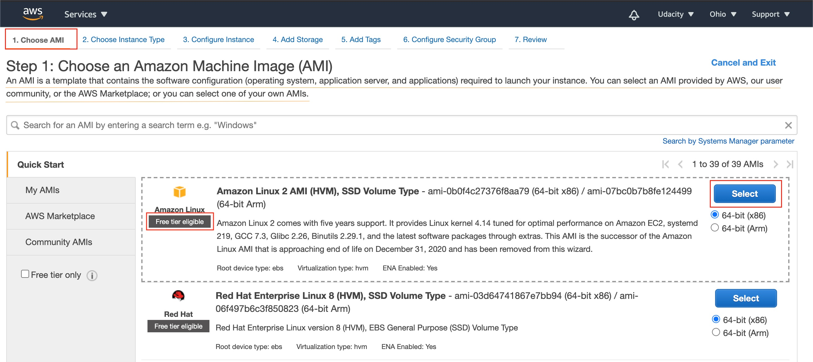

We are looking for AMI Ubuntu Server 18.04 LTS x86" - ami-0ac73f33a1888c64a

    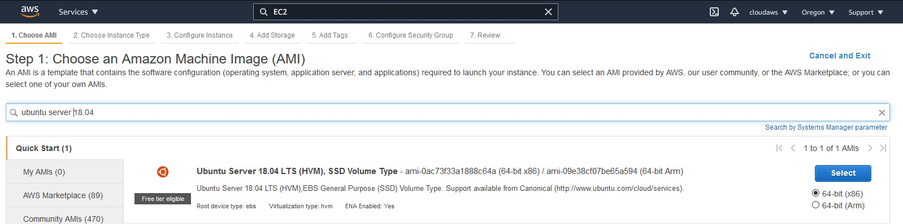

#### Step 2 - Choose an Instance Type

Instance Type offers varying combinations of CPUs, memory (GB), storage (GB), types of network performance, and availability of IPv6 support. AWS offers a variety of instance types, based on the configuration you choose. Prefer to choose any one of those types supported by a free tier account. 

    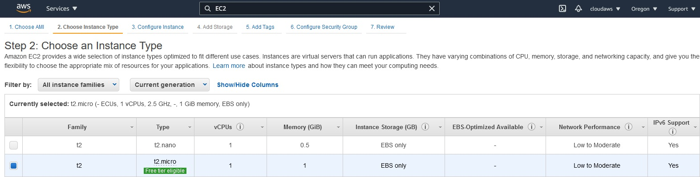

Select the hardware configuration of your instance. The t2.micro instance type, which is available under the free tier, is selected by default. It has 1 vCPU, 2.5 GHz, 1 GiB memory, the default root volume, and supports additional EBS storage.

#### Step 3 - Configure Instance Details

Provide the instance count and configuration details, such as network, subnet, behavior, monitoring, etc.

    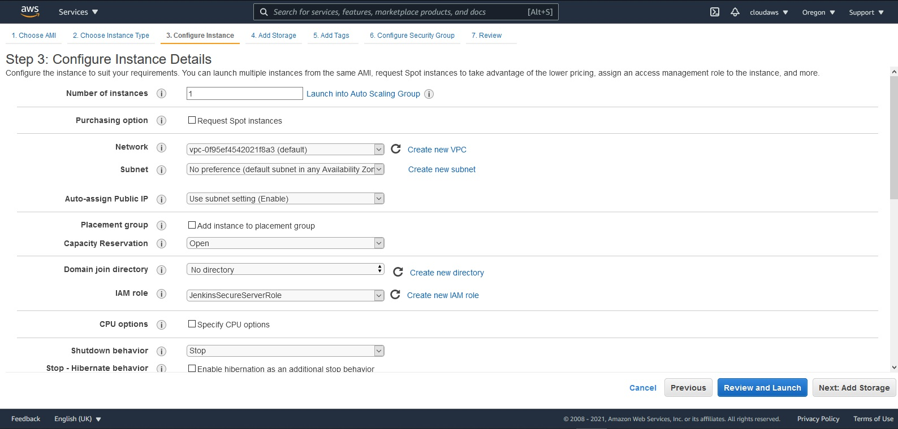

#### Step 4 - Add Storage

You can choose to attach either SSD or Standard Magnetic drive to your instance.

    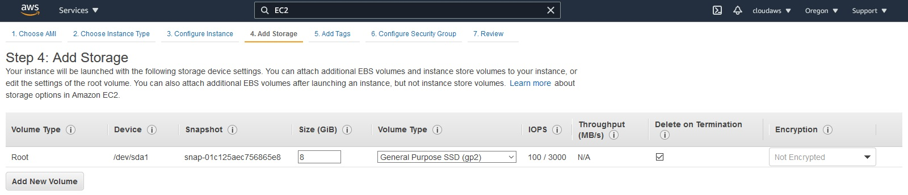

#### Step 5 - Add Tags

A tag serves as a label that you can attach to multiple AWS resources, such as volumes, instances, users, or roles. Tagging helps in easy search and grouping resources for various purposes.

    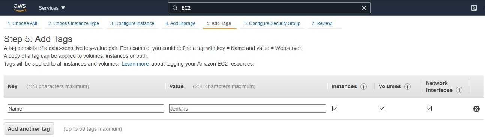

Add Tags. Tags help to categorize the resources across AWS services. It works as a label. 

#### Step 6 - Configure Security Group

Attach a set of firewall rules to your instance(s) that controls the incoming traffic to your instance(s).

    

Security Groups. It defines the firewall rules, such as the protocol to open to network traffic and the set of valid IP addresses. By default, SSH protocol is used for a Linux instance and RDP for a Windows instance. HTTP and HTTPS allow Internet traffic to reach your instance.

    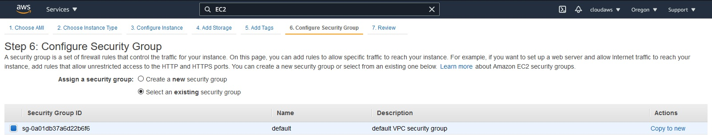
	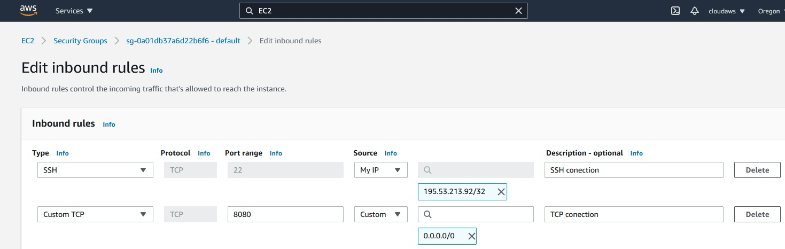

Or you can choose the one that is created by default.

#### Step 7 - Review

Review your instance details before the launch.

    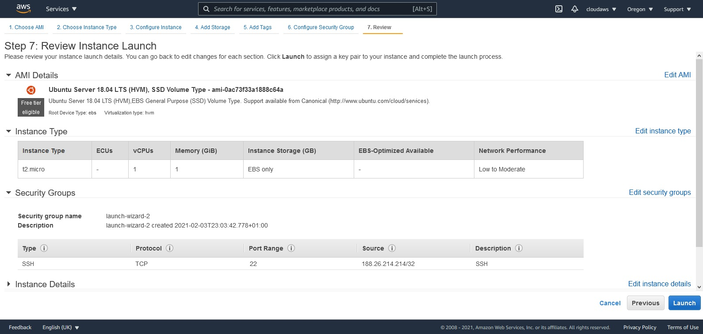

#### Step 8 - Download Key Pair

AWS generates a pair of public and private (encrypted) keys, that help in logging into the EC2 instance. Download the private key (.pem file) locally. The public key will be stored on the EC2 instance, while the private key will be available to download locally, just once. In case, if the private key file (.pem) is misplaced or lost, the AWS doesn't allow regenerating the private key. 

    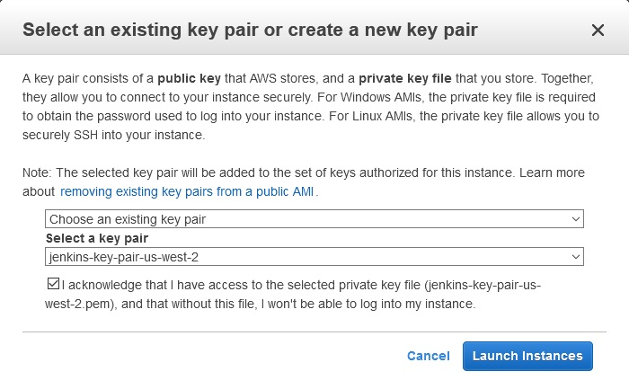

Download Private Key or you can choose the one that is created by default.

    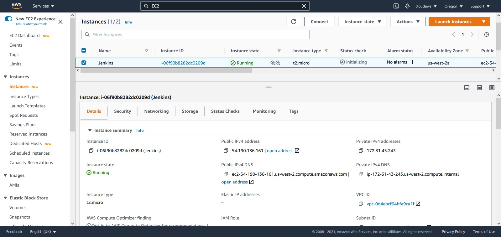

